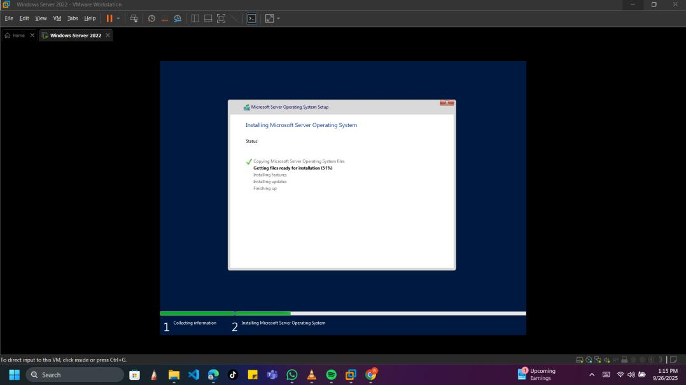
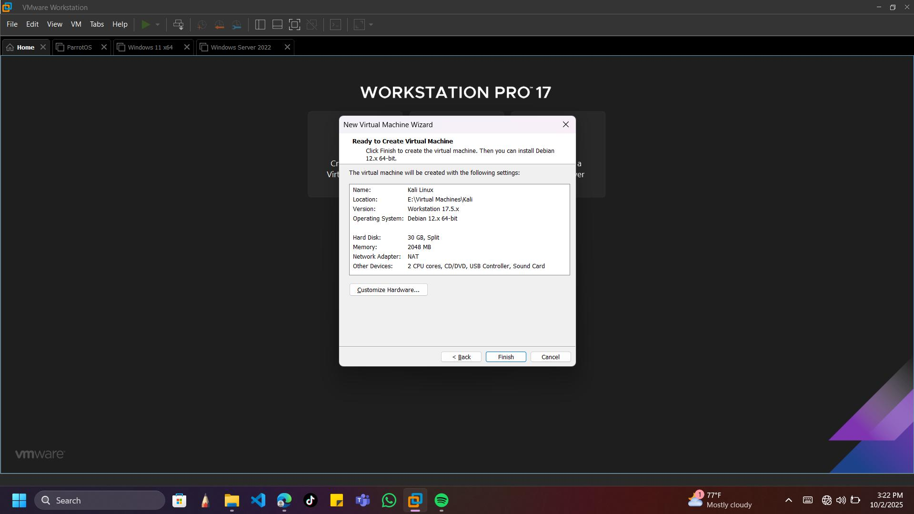
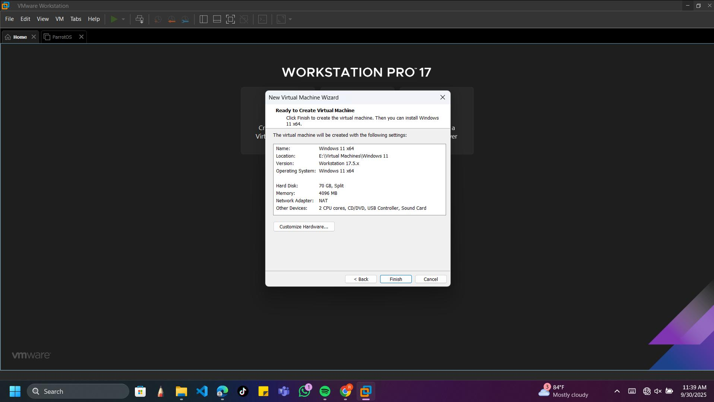
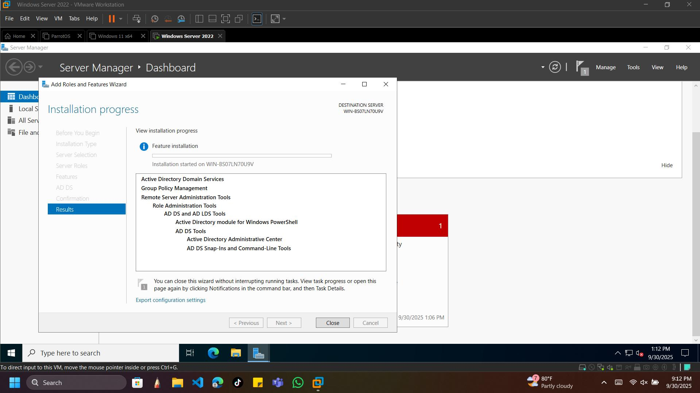
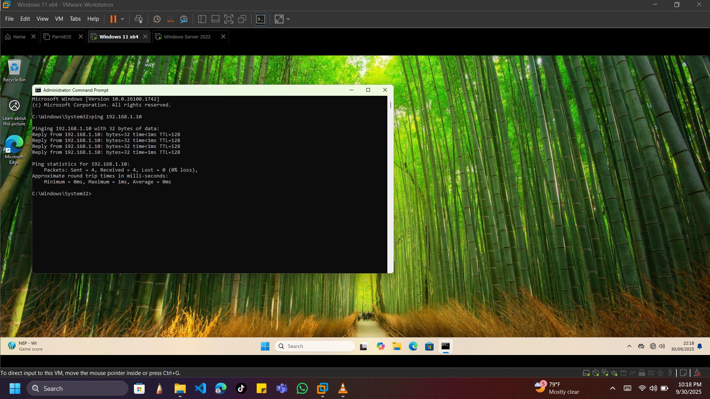
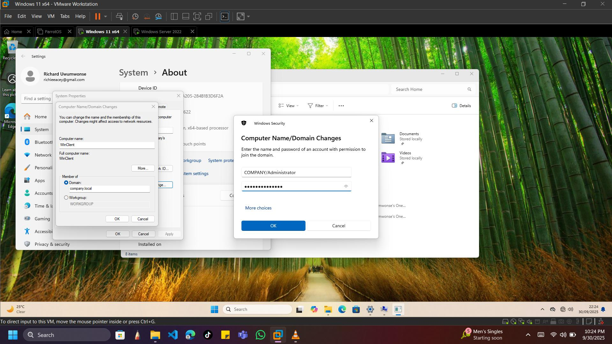
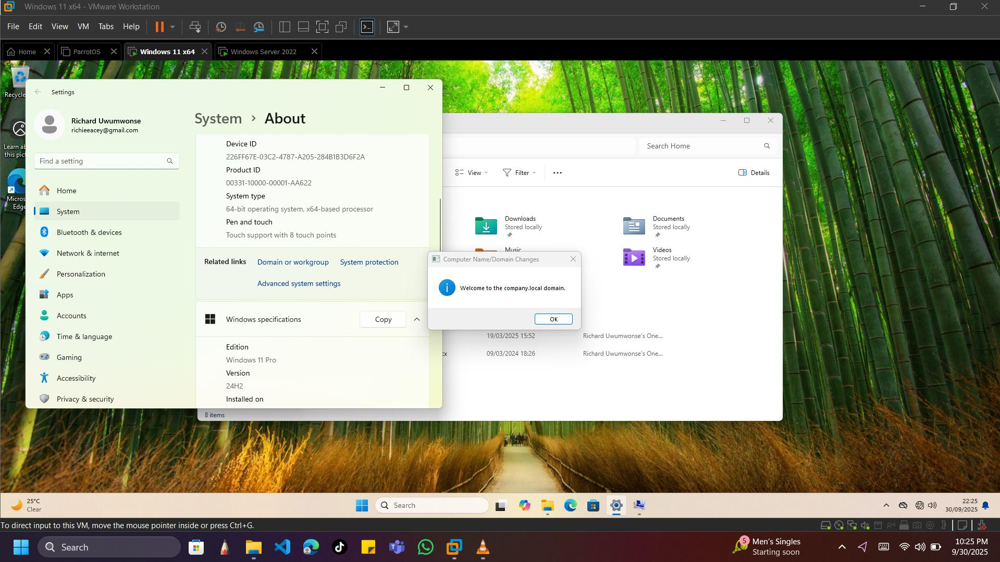
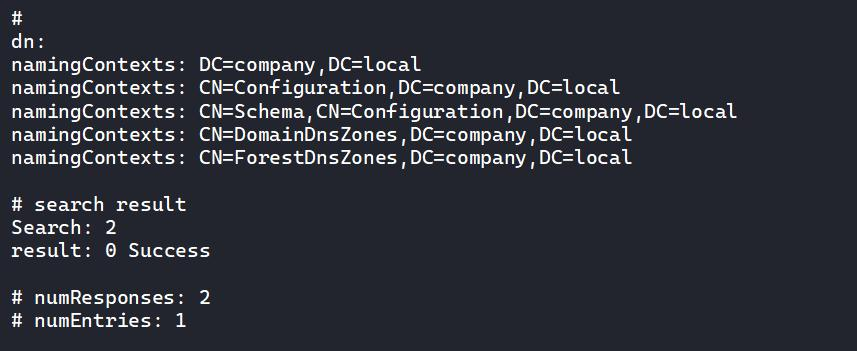
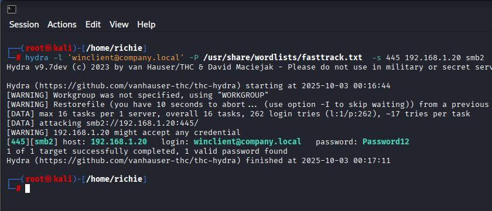
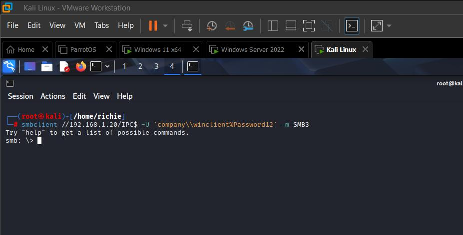

# Virtualized Lab Environment Setup & Security Testing

The goal of this project is to create an isolated network of three virtual machines for the purpose of testing the security of the network. This network comprises a Windows server acting as an AD Domain Controller (DNS+AD), a Windows Client (Windows 11 Pro) joined to the domain, and a Kali Linux which will be used to attempt penetration of this network. All installations are done with NAT first so that any required updates can be carried out on the machines, before switching to Host-only. The Kali Linux is given two network adapters, NAT and Host-only. VMware Workstation Pro is my Hypervisor on this project.

## Steps taken to achieve this:

### 1. Virtual Machines Installation

**Installation of Windows Server 2022:**
Firstly, I clicked on create new virtual machine, selected configuration type as Custom (advanced). In the select operating system prompt, I clicked on “I will install operating system later.” Guest operating system is selected as “Microsoft Windows”, Firmware Type --> UEFI, assigned name to virtual machine as “Windows Server 2022”, selected location that I want it to be installed, assigned a memory of 4GB, Network type --> NAT, LSI Logic SAS (Recommended) as the logic controller, virtual disk type --> NVMe (Recommended), allocated a storage of 60GB, then I clicked on “Finish”. I then went to edit virtual machine settings, selected my Windows Server ISO image file, and powered on the machine. The rest was an intuitive Windows installation.



**Installation of Kali Linux:**
*   **Configuration type:** Custom(advanced)
*   **Guest operating system:** Linux, version --> Debian 12.x64
*   **Virtual Machine Name:** Kali Linux
*   **Memory assigned:** 2GB
*   **Network type:** Network Address Translation(NAT)
*   **Logic controller:** LSI Logic SAS(Recommended)
*   **Disk type:** SCSI(Recommended)
*   **Specify Disk Capacity:** 30GB
*   **ISO Location:** Selected "Use ISO image file" under New CD/DVD(SATA) and pointed to the Kali Linux ISO.



**Installation of Windows Client (Windows 11 Pro):**
*   **Configuration type:** Custom (Advanced)
*   **Encrypt virtual machine:** required for windows 11
*   **Firmware type:** UEFI
*   **Virtual Machine Name:** Windows 11 x64
*   **Processors:** 2 processors, 1 core per processor
*   **Memory assigned:** 4GB
*   **Network type:** Network Translation Adapter(NAT)
*   **Disk type:** NVMe(Recommended)
*   **Specify Disk Capacity:** 70GB



---

### 2. Domain Controller and Network Configuration for Windows Server

I started by installing the AD DS and DNS on the windows server. The first step is to open the server manager; under the “Manage” option there’s a drop down menu.
*   I selected Add roles and features
*   **Installation type:** Role based or feature based installation
*   **Server Roles:** Active Directory Domain Services
*   Added features that are required for Active Directory Domain Services, and clicked Install.
*   After Installation, clicked on **Promote this server to a domain controller**.
*   **Deployment configuration:** Add new forest, root domain name --> `company.local`
*   Set Password for the Director Services Restore Mode.
*   **NetBIOS domain name** assigned automatically as `COMPANY`.
*   **Database folder / Log file folders:** `C:\Windows\NTDS`
*   **SYSVOL folder:** `C:\Windows\SYSVOL`

All Prerequisites checks passed successfully, and the system was restarted.



---

### 3. Lab Topology and Configuration

At this stage, I switched the network adapter from NAT to Host-Only for both the Windows Server and the Windows Client. I then added another Host-only adapter to the Kali Linux (the NAT will be used to access the internet when needed, and the Host-only Ethernet will connect all three virtual machines together). To do this, I set static addresses to all the virtual machines.

**Network configuration of the virtual machines:**
*   **Windows Server:** Static IP address `192.168.1.10` on Host-Only adapter. Default gateway is `192.168.1.1`, DNS pointed to `192.168.1.10` (Domain controller is DNS), Subnet mask is `255.255.255.0`.
*   **Windows Client:** Static IP address `192.168.1.20` on Host-Only adapter. Default gateway is `192.168.1.1`, DNS pointed to `192.168.1.10`, Subnet mask is `255.255.255.0`.
*   **Kali Linux (Attacker):** Static IP address `192.168.1.30` on Host-Only, and an automatic DHCP IP on NAT. Default gateway is `192.168.1.1`, DNS pointed to `192.168.1.10`, Subnet mask is `255.255.255.0`.

**Commands used to set static IP for Kali Linux:**
```bash
sudo su
nmcli con modify "Wired connection 1" ipv4.addresses 192.168.1.30/24
nmcli con modify "Wired connection 1" ipv4.gateway 192.168.1.1
nmcli con modify "Wired connection 1" ipv4.method manual
nmcli con up "Wired connection 1"
```

A ping test was done on each virtual machine to confirm the connection.



**Important design decisions and rationale:**
1.  **Host-only network** makes sure the AD lab traffic is isolated from the real network (safer).
2.  **NAT adapter** on attacker only provides internet for package installation and upgrades.
3.  Attacker is provided with two adapters: Host-only for lab communication and NAT for internet access simultaneously.

---

### 4. Join Domain from Windows Client

Under System properties on the Windows client, I clicked on computer name, then clicked on the “change” button. I was prompted to add a computer name (I left it as `WinClient`), then I clicked on Domain, typed in the name of the domain I created on the Windows server (`company.local`). When prompted, I used the credentials of the Domain Controller to join the domain and restart.



---

# Kali Linux Security Testing

## RECONNAISSANCE

### NMAP Scan
The first step was to do an nmap scan on the target’s subnet (`192.168.1.0/24`). This is done to analyze ports that are vulnerable and open to possible exploits.

```bash
nmap -sS -T4 -F --open 192.168.1.0/24
```
*   `-sS`: TCP SYN stealth scan to detect open ports without completing the TCP handshake.
*   `-T4`: Aggressive timing template to speed up the scan.
*   `-F`: Fast scan (top 100 ports).
*   `--open`: Show only open ports.

**OBSERVATIONS:**
Taking the position of an attacker with no prior information, I can see two Hosts are up (`192.168.1.10` and `192.168.1.20`). On the first Host (Server), ports 53, 88, 135, 139, 389, 445 are open. On the second Host (Client), ports 135, 139, 445 are open.



---

## ENUMERATION

Since port 445 (SMB) is open, we can use `enum4linux` to enumerate the SMB shares on both targets.

**First host:**
```bash
enum4linux -a 192.168.1.10
```
*   *Observation:* I gathered the domain name (`COMPANY`), the machine name (`WIN-BS07N70U9V`), and identified it as a Domain Controller.

**Second host:**
```bash
enum4linux -a 192.168.1.20
```
*   *Observation:* Identified the machine name as `WINCLIENT` and confirmed it has no domain controllers listed (it is a client under the `COMPANY` domain).

### LDAP Search
With port 389 open, we can do a Lightweight Directory Access Protocol (LDAP) search to find the domain name.
```bash
ldapsearch -x -H ldap://192.168.1.10 -s base -b "" namingContexts
```
*   *Result:* Extracted the complete domain name of the server: `DC=company, DC=local` -> `company.local`.

### Kerberos Enumeration
Kerberos runs on port 88. Using a list of common names, we will use `kerbrute` to enumerate usernames by checking for valid Kerberos principals.
```bash
kerbrute usernum -d company.local --dc 192.168.1.10 namelist.txt
```
*   **OBSERVATIONS:** I was able to get a valid username which is `administrator@company.local`.



---

## EXPLOITATION

### Anonymous SMBclient Login Attempt
```bash
smbclient -L //192.168.1.20 -U 'company\winclient' -m SMB3
```
It prompts us for a password, so now we have to move on to more active measures like password attacks.

### Password Attacks Using a Recompiled Version of Hydra
After much research, I discovered that the default version of hydra (9.5) had no support for SMB2, which is required for password attacks on recent Windows OS versions. I had to recompile to get the most recent version of hydra (`9.7dev`). 

```bash
hydra -l 'winclient@company.local' -P /usr/share/wordlists/fasttrack.txt -s 445 192.168.1.20 smb2
```



**OBSERVATIONS:**
After 262 login tries by hydra, I was able to get the password `Password12` for the target `winclient`. The attack was successful.

### SMBmap Scan
Now that I have the username and password, I can run an `smbmap` scan to enumerate available shares.
```bash
smbmap -u 'winclient' -p 'Password12' -d company -H 192.168.1.20
```

### SMBclient Login
From the `smbmap` results, `IPC$` has READ ONLY permissions. We can log into that disk using `smbclient`:
```bash
smbclient //192.168.1.20/IPC$ -U 'company\winclient%Password12' -m SMB3
```
*   **OBSERVATIONS:** The appearance of the `smb: \>` prompt indicates that our login was successful.



---

## FINDINGS AND SECURITY IMPLICATIONS

1.  Open SMB (445) port was present on the client and accepted authentication with valid credentials.
2.  The AD telemetry exposed user and host information with LSAP / DNS SRV records.
3.  Too many important ports left opened.
4.  Valid credentials found (`company\winclient: Password12`), which shows potential for lateral movement or data access depending on privileges.

## Remedies and Hardening Recommendations

1.  Ensure to enforce strong password policies, and MFA for privileged accounts (passwords like “Password12” are common and weak).
2.  Enable and enforce SMB signing and restrict SMB protocols.
3.  Restrict ADMIN shares.
4.  Monitor and alert on unusual authentication patterns; watch out for rapid failures and spray-like behavior.
5.  Apply principle of least privilege.
6.  Apply host-based firewall rules to restrict management ports to known admin subnets.
7.  Regularly update Windows systems and rotate service and admin credentials.
8.  Implement network segmentation and limit exposure of domain controllers.

## TROUBLESHOOTING AND SOLUTIONS

*   **Network adapter confusion:** I couldn’t figure out how to have access to the internet as well as connect to the windows server subnet with a static IP. After much troubleshooting, I found out that I needed to add a second adapter, and that solved my problem.
*   **Hydra SMB module errors:** I kept getting ‘invalid reply’ while trying to do a password attack with hydra 9.5 which only supported smb1. I found a solution online that I had to recompile my hydra so it can support SMB version 2.
